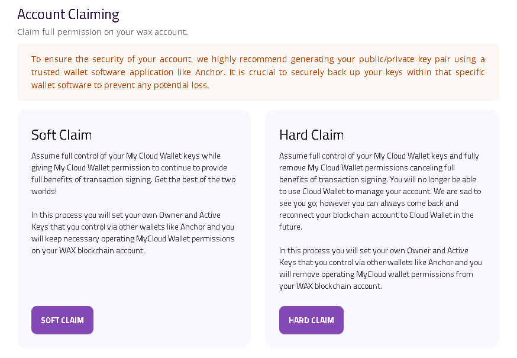

# A-DEX


[https://wax.a-dex.io/](https://wax.a-dex.io/)


### Introduction:

Coming soon ..!


Uniquely to A-DEX, there are no native "Farm/Liquidity Provider Reward" features integrated onto the platform in itself, yet. However, as it uses LP-position tokens (similarly to tacoswap), it is possible for projects to incentivize or reward Liquidity staked onto the platform via other means.\
\
We will consider using snapshots, and possibly WaxDAO Token Farm staking of the LP-tokens to reward locking up PXJ and KING into this part of Wax DeFi as well! 🤝


### PXJ and KING on A-DEX:

The following Journey related pairs are already open and available on A-DEX:

* PXJ/WAX
* KING/WAX
* (soon: PXJ/KING, and more!)

### Analytics on A-DEX:

A-DEX liquidity pairs and positions do for the time being not show up on WaxOnEdge analytics, however they have their own analytics overview page which can easily be explored via their own platform:


[https://wax.a-dex.io/analytics](https://wax.a-dex.io/analytics)


### Swap:

The Swap page has 4 tabs:

* Swap
* Liquidity
* Send
* Buy


[https://wax.a-dex.io/swap](https://wax.a-dex.io/swap)


### Adding DeFi Liquidity onto A-DEX

Adding liquidity onto A-DEX is only a few simple steps!

* Select Add (or remove) Liquidity
* Select your Base token (WAX)
* Select your Quote token to pair up
* Use the slider, or insert the amount desired to deposit/remove
* Review the details, and click on the "Confirm" button to initiate the transaction

<figure><figcaption></figcaption></figure>

### The Send Tab

On the Send tab you can with a simple UI easily send any tokens from your Wax Wallet onto other accounts on the Wax Network.

<figure><figcaption></figcaption></figure>

### Buy Crypto using CC on A-DEX (via MoonPay):

On the last tab of the swap part of A-DEX, we have the Buy section, where you can exchange crypto with WAXP, or use a Credit Card directly without KYC necessary.

<figure><figcaption></figcaption></figure>

### A-DEX on other blockchains:

A-DEX is also available for the EOS and Telos Networks from the Antelope Ecosystem.

Make sure you have entered the "https://**wax."** version of the platform, or change the network selected next to the wallet connect button in the top right corner.

<figure><figcaption>
Select Network by clicking the Network Icon to the left of "Connect Wallet"
</figcaption></figure>

### A-DEX Guild

The A-DEX platform is created by the A-DEX Guild on Wax, which began in the end of 2024.

If you like it, then vote for them in Wax Network governance, and add liquidity onto their platform to boost their network product ratings! 💪&#x20;

### A-DEX on X/twitter


[https://x.com/a\_dex\_official](https://x.com/a_dex_official)

