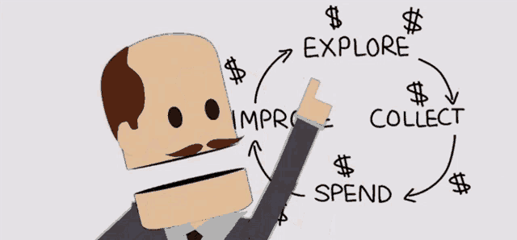

# 🗺️ Roadmap

## Season 1 (starting from Wax)

<figure><figcaption></figcaption></figure>

1. PXJ Token Launch: We'll kick things off by launching our PXJ token on the Wax network, initiate liquidity pools with various token pairs across the ecosystem from Alcor and TacoSwap.
2. PXJ Liquidity Pool Rewards: 20(-25)% of our Season 1 PXJ token allocation will be added to LP and staking rewards across Alcor, TacoSwap and Pepperstake.
3. Partnerships and Community Growth: Months will be dedicated to forming partnerships, organizing events, and expanding our community.
4. PFP Collection: Our collection of 10000 Profile Pictures (PFP) in the beginning of 2024, named Pixals will open up new optional paths to be taken in our Pixel Journey/economy.
5. Pixel Recycling: We'll allow burning up to 80% of the PFPs to release their pixels via PixelPacks, which will be recycled into other collectibles using the Neftyblocks blends and NFThive crafts.
6. Pixel Upgrading and Combining: Through blending contracts, we'll enable the upgrading of single pixels and combining them to create more advanced collectibles, or higher upgraded versions of other PJ assets.
7. Airdrop and Collectibles: We'll airdrop rocks and pets based on random traits from the PFP drop sales. Other Pixel blenders and collectors will also have the opportunity to obtain them via Pixel crafting.
8. Collectibles Staking: We'll create staking mechanisms for our collectibles to produce our PXJ token, up to certain shares of the \~20% Season 1 PXJ allocation dedicated towards NFT rewards (subject to voting by the WaxRocks/PixelDAO)
9. WaxRocks Council: We'll establish our Council, an influential advisory community board consisting of a up to a few hundred potential users. They will participate in voting on community decisions.
10. Next Drop/Blending Event: By the end of season 1, we'll conduct a drop or blending event featuring a decorative collectible that requires a PFP, individual pixels, and a third ingredient purchasable with our PXJ token.
11. dApp Utility and Upgrade: In the spring-summer of '25 we'll reveal a planned dApp utility and an upgrade opportunity for the first season of assets, which will bind the entire project together and pave the way for future expansion.
12. Season 2 and dApp Expansion: We'll kick off Season 2 of our PFPs with new art traits in mid '25, scheduled for our 2 year anniversary, while preparing to reveal our further plans for the routes through the Polygon/Ethereum ecosystems.

Our approach to achieving these milestones is through careful project design at every step and layer, as well as thorough planning and active balancing of the projects burn/faucet mechanics to ensure we can maintain stability and sustainability.

We believe that by working together, we can overcome any challenges and contribute to a healthier Web3 scene. Education is crucial to absolutely everybody entering into this Wax/crypto space, so let's try help everybody starting on this shared journey with all the knowledge and support that we can. And collectively make collecting JPEGs, NFTs and crypto a little greater again! 🛸

## Season 2 (Solana/POL Meme SZN?!)

### Exciting Updates for Season 2

We're thrilled to announce that Season 2 is just around the corner, and we couldn't be more excited to share what's in store for our community! Our team has been hard at work, listening to your feedback and implementing a series of features and enhancements that promise to elevate your experience to new heights.

#### What's Coming?

In Season 2, you can expect:

1. **New NFT Collections**: Dive into fresh and exclusive collections that showcase creativity and innovation, expanding your portfolio and offering exciting opportunities to explore unique assets.
2. **Enhanced User Experience**: We've refined our platform's interface to be even more intuitive and user-friendly, ensuring that both newcomers and seasoned veterans can navigate with ease.
3. **Community Events**: Engage with the community through a variety of events designed to foster interaction and collaboration. These events will provide opportunities to learn, share, and grow together.
4. **Educational Resources**: Access a wealth of knowledge tailored for everyone—from beginners to advanced users—covering topics such as NFT creation, blockchain technology, and investment strategies.
5. **New Ever More Surprises Ahead**: As part of our commitment to building a FUN web3 journey as well, we can't wait to reveal upcoming surprises (possibly involving new upcoming partners? and other events) in our Second Season of the journey, with details to be released as we go.

#### Get Involved!

Don't miss out on the chance to be part of this exciting new chapters to come. Join us as we continue to build and enhance our ecosystem. Stay connected through our social media channels and community forums for real-time updates, sneak peeks, and more information on how you can participate.

In our Discords Community Contribution Sections we'll be bringing up some hot discussions in the pre-season over the Spring of '25, to help direct how our 2nd Season will end up taking shape.

Thank you for being an integral part of our journey. The future looks pixel perfectly bright, and we can't wait to share this whole journey with all of you!
