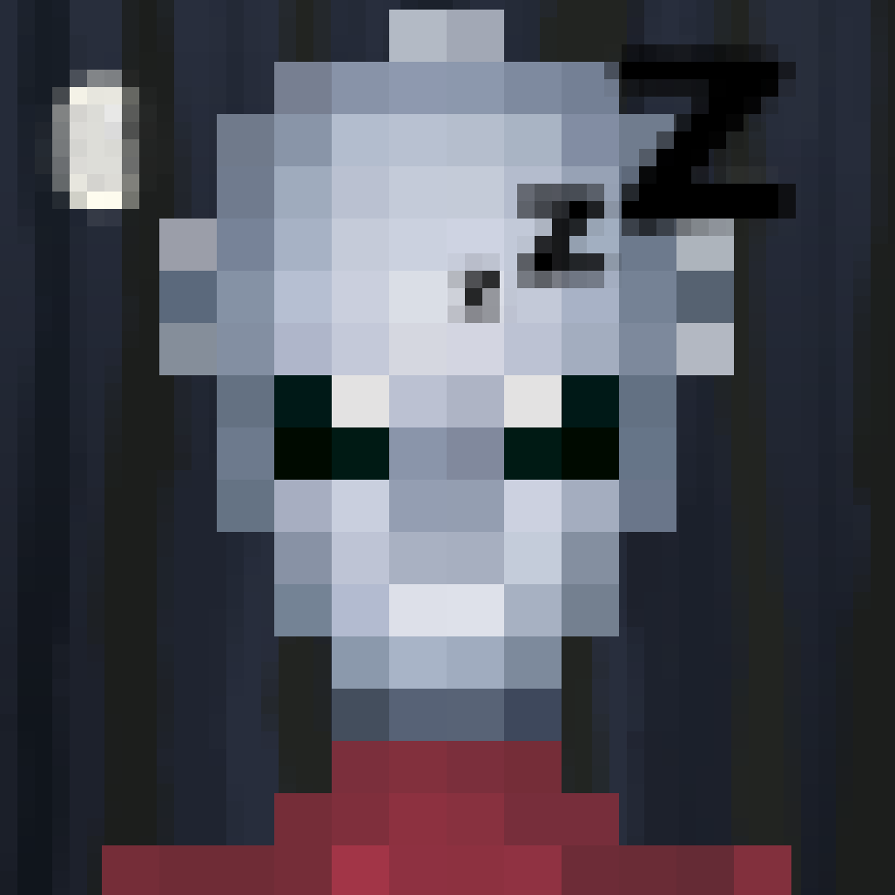

# 💫 Season 1 (Starting from Wax)


**If you're new to Wax:** [Check out our introductions to how to get set up on the Wax Blockchain here](../../fundamentals/getting-set-up-on-wax/).


## Where it all begins

As mentioned up in [The Pixel Journey Begins](../the-pixel-journey-begins.md), this is much about exploration and creating a collective journey through the wide crypto/NFT where we showcase the various options and help each other / everybody get the best start possibly into this shared space.

We plan to do the exploration by seasons, with each season lasting 6-12 months, and each season revolving (mostly) around adding onto our PixelJourney features/economy/collectibles, using the best features of each different blockchain.

In this first season we'll go through "all about Wax", and set up the foundation to our Pixel Journey world/economy from here. We'll learn about Wax/EOS NFTs, the available services on the ecosystem (like TacoSwap, Nefty/NFTHive or WaxDAO features). We'll introduce our own ['$PXJ token'](kickstarting-the-pxj-economy/), and various (tactical) faucet/burn mechanics along the way. And we've already got a ton of surprises planned for the paths to come! 🥳🛸

Later in the season we'll explore bridging to Polygon, and once season 2 begins we'll shift our focus to the possibilities there as well.\
Each season is planned to start with a drop/craft/event, where people can join in for the journeys scheduled, and then again end with a season-finale event where participants will be able to craft/claim another PFP - if they are lucky or active enough to have secured the required collectibles along the journey up till then).

We will initially aim for 10k Pixal PFPs, and those will be the first source of our Pixel ingredients.\
From the total supply, up to 80% will be allowed to be burned/recycled for packs (further unpackable for craftable/stakable single-pixel ingredients).&#x20;

<figure><figcaption>
A Pixal PFP featuring traits from the "Wold of Cryptopups" collection on the Wax Blockchain
</figcaption></figure>

## The Season 1 plan summarized:

* Onboarding to the Wax Blockchain 🔄️
* Collective Community DYORing on the Wax Blockchain 🔄️
* NFTHive PFP Drop features ✅
* NeftyBlocks blends, drops and unpacking features&#x20;
* Secondary tokens on the Wax blockchain with out introduction of $PXJ ✅
* NFT to secondary token redeemables ✅
* TacoSwap, Pepperstake & Alcor Exchange Token Staking features ✅
* WaxDAO Staking ✅
* SixPMs HoneyComb Discord Linking utility for ownership linked roles ✅
* NFTHive Crafting features 🔜
* How to create NFTs on the Wax Blockchain ✅
* How to trade NFTs on the Wax Blockchain ✅
* How to bridge NFTs to/from the Wax Blockchain ✅
* Spreading the word of the Pixel Journey and the ecosystems we Pixals inhabit 🔄️
* Discovering other great artists, projects and communities across the ecosystems our journey reaches! 🔄️
* Becoming the best learning resource on Wax 🔄️
