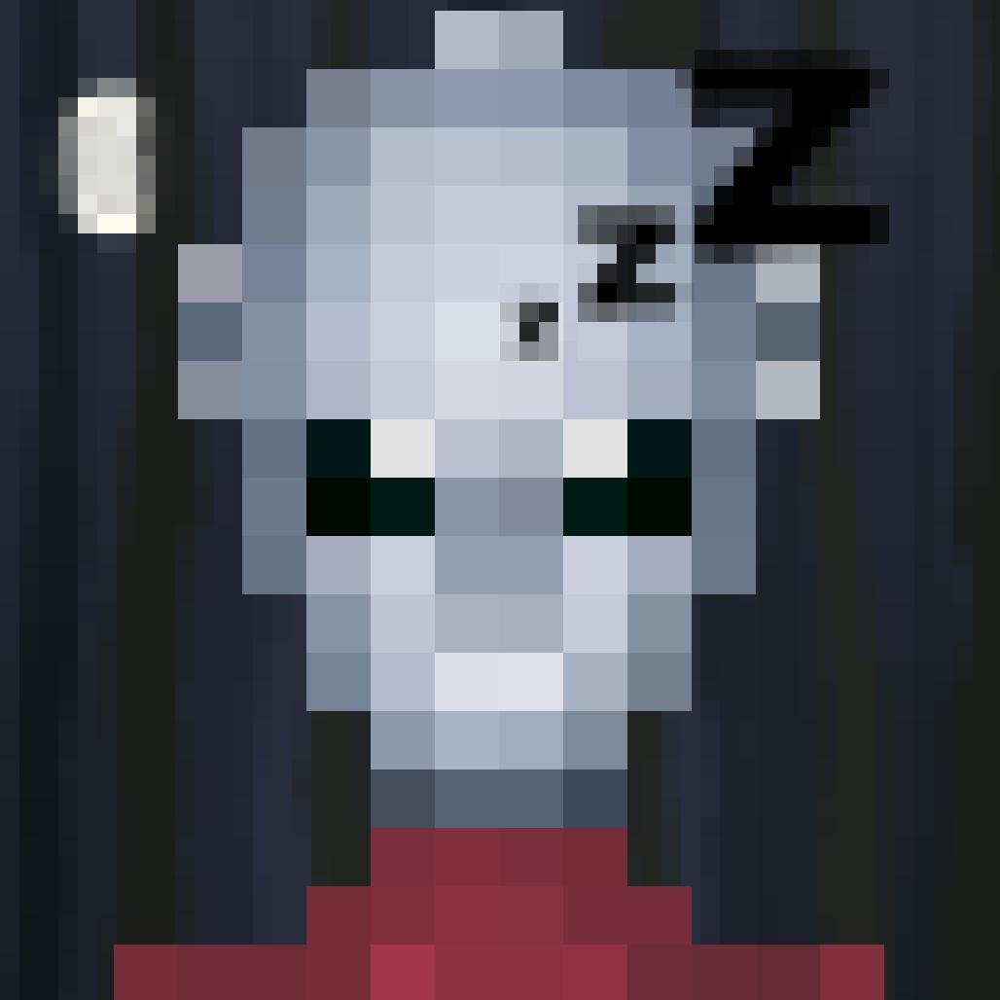

# 💫 Season 1 (starting from Wax)


**If you're new to Wax:** [Check out our introductions to how to get set up on the Wax Blockchain here](../../fundamentals/getting-set-up-on-wax/).


## **Where It All Begins**

As we embark on **The Pixel Journey**, our mission is to explore the **NFT and crypto space together**, creating a shared experience that helps newcomers and veterans alike navigate the **vast Web3 landscape**.

### **Seasonal Exploration**

We structure our journey into **seasons**, each lasting **6–12 months** and focusing on **different blockchain ecosystems**. Every season builds upon the previous one, expanding **Pixel Journey’s features, economy, and collectibles** while leveraging the best tools and innovations from each blockchain.

### **Season 1 – The Wax Blockchain Foundation**

Our first season is all about **mastering the WAX ecosystem** and laying the groundwork for our **Pixel Journey world and economy**:

✅ **Learning about WAX & AtomicAsset NFTs** – Understanding their **unique advantages, marketplaces, and tools**.\
✅ **Exploring Key Ecosystem Features** – Hands-on use of **WaxOnEdge, TacoSwap, Alcor, NFTHive, and WaxDAO**.\
✅ **$PXJ Token Introduction** – Establishing **token utility, strategic burn/faucet mechanics, and staking opportunities**.\
✅ **Surprise Events & Community Rewards** – Keeping engagement high with **unexpected twists and exclusive content**.

### **Bridging to New Frontiers**

Later in **Season 1**, we'll explore **bridging to Polygon**, setting the stage for **Season 2**, where our focus will shift toward **new ecosystems and expansion**.

### **Season Structure & Participation**

Each season begins with a **drop, crafting event, or interactive experience**, allowing participants to join in and start their journey. The season then **culminates in a grand finale event**, where active participants can **craft or claim a new PFP—if they’ve secured the necessary collectibles along the way!**

### **Pixal PFPs & Ingredient System**

🔹 **10,000 Pixal PFPs** – The **first source of Pixel Ingredients** in Pixel Journey.\
🔹 **Recycling Mechanics** – Up to **80% of Pixals can be burned** to generate **PixelPacks**, which **unpack into craftable, stakable single-pixel ingredients**.

Each step of the journey is designed to **empower collectors, traders, and enthusiasts** while ensuring that **our economy remains sustainable and rewarding**.

Are you ready to **explore, craft, and adventure** with us? 🚀🎨

<figure><figcaption>
A Pixal PFP featuring traits from the "Wold of Cryptopups" collection on the Wax Blockchain
</figcaption></figure>

## The Season 1 plan summarized:

* Onboarding to the Wax Blockchain 🔄️
* Collective Community DYORing on the Wax Blockchain 🔄️
* NFTHive PFP Drop features ✅
* NeftyBlocks blends, drops and unpacking features&#x20;
* Secondary tokens on the Wax blockchain with out introduction of $PXJ ✅
* NFT to secondary token redeemables ✅
* TacoSwap, Pepperstake & Alcor Exchange Token Staking features ✅
* WaxDAO Staking ✅
* SixPMs HoneyComb Discord Linking utility for ownership linked roles ✅
* NFTHive Crafting features 🔜
* How to create NFTs on the Wax Blockchain ✅
* How to trade NFTs on the Wax Blockchain ✅
* How to bridge NFTs to/from the Wax Blockchain ✅
* Spreading the word of the Pixel Journey and the ecosystems we Pixals inhabit 🔄️
* Discovering other great artists, projects and communities across the ecosystems our journey reaches! 🔄️
* Becoming the best learning resource on Wax 🔄️
