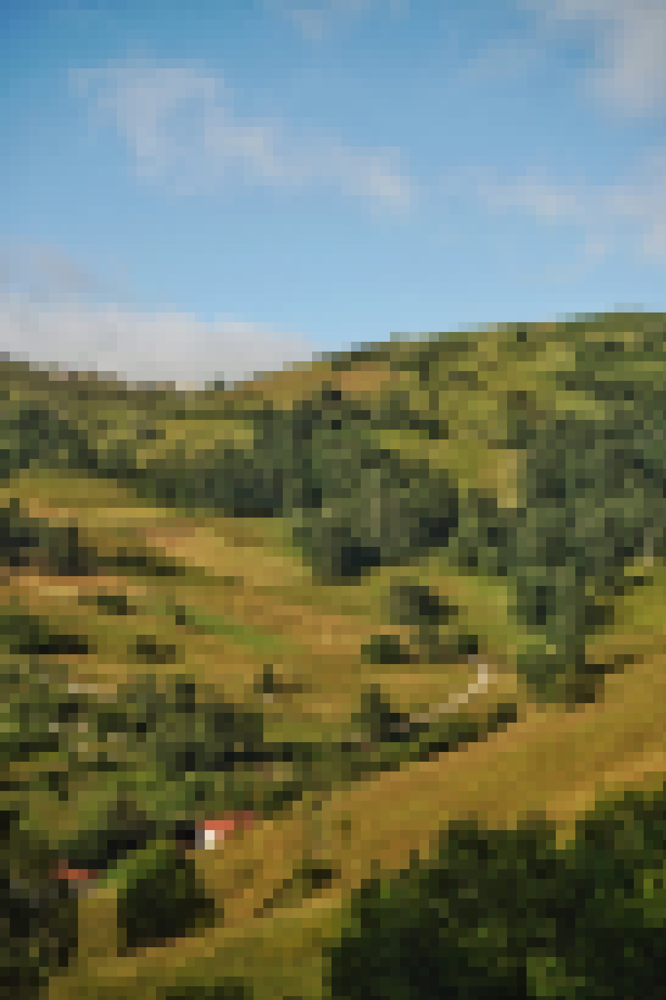

# Pixel Blends & Upgrades

As part of our Pixel Journey mechanics, we'll have Pixel Upgrading of various collectibles/pixelpromo assets.

<figure><figcaption></figcaption></figure>

 

<figure><figcaption></figcaption></figure>

 

<figure><figcaption></figcaption></figure>

An example of this can be seen just here above, where one of Pigas photos can be seen in its various low-definition pixelated forms.&#x20;

Multiple steps of different assets can/will be made available to upgrade through, in quickly decreasing max mints/availability.&#x20;

Each step might unlock new details, and change the 'quality' of the collectible quite a lot. As well as possibly get to unlock certain added or improved features, such as high staking power or other future utilities.

<figure><figcaption>
Full definition Image Example (this can either be as part of the Pixel Journey collection itself, or to be unlocked in their respective artists own collections.
</figcaption></figure>

The final/top resolution versions of each assets may turn out to be extremely hard/expensive to acquire, and can be as limited as being 1/1s, for the most dedicated collectors to acquire.

These collectible blending/upgrade mechanics may further extend to other schemas/parts of the Pixel Journey as we move on as well 🫡🧑‍🔬🧪
