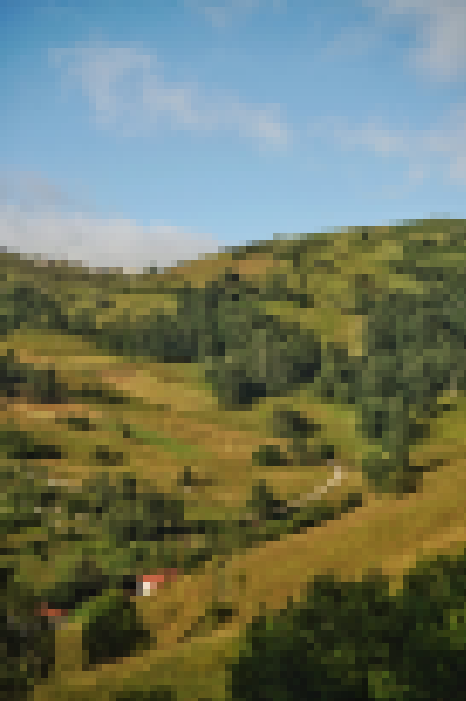

# Pixel Collectibles

Most of the collectibles further along in the journey will be obtainable in the various ways:

1. Primarily created (and further upgraded) with PXJ
2. Via occasional random Pixal PFP Trait airdrop rewards
3. Via TacoSwap NFT-staking rewards
4. Via events and giveaways on our SoMe servers/Twitters
5. Via blends/crafts made available along the way using NFTHive, WaxDAO and NB Blends/Crafts, recycling prior collectibles

Each different type of collectible may end up having slightly different crafting demands, as well as mint-availability, and will be announced via our channels well ahead of becoming unlockable.

For the main Season 1 collectibles series Piga's photography will come in 5 tiers.&#x20;

* The Tier 1 Definition Base level, comes in 10k units at 200

Most of our most common crafts will be in a supply that is unlikely to run out. In the other end more exclusive crafts along the way may end up selling out quickly, or having a small sale window of availability, so those interested collectors will need to be ready for, and quick to claim.

<figure><figcaption>
A PigaPhoto asset in Pixelated form, that can also be found among the Pixal PFP Background traits
</figcaption></figure>

As an extra special feature among certain of our [Pixal PFP](../the-pixal-pfps/) (background) traits; Holders of certain traits will automatically have an added chance of occasionally getting pixelated photography (initially mainly from [Piga](../../the-pxjourney-team.md)) airdropped.

These pixelpromo/collectibles will be among the first of our upgradable NFTs, and you can read more about how that works in this following section.

### Collectibles Upgrades

As part of our Pixel Journey mechanics, we'll have Pixel Upgrading of various collectibles/pixelpromo assets.

<figure><figcaption></figcaption></figure> <figure><figcaption></figcaption></figure> <figure><figcaption></figcaption></figure>

An example of this can be seen just here above, where one of Pigas photos can be seen in its various low-definition pixelated forms.&#x20;

Multiple steps of different assets can/will be made available to upgrade through, in quickly decreasing max mints/availability.&#x20;

Each step might unlock new details, and change the 'quality' of the collectible quite a lot. As well as possibly get to unlock certain added or improved features, such as high staking power or other future utilities.

<figure><figcaption>
Full definition Image Example (this can either be as part of the Pixel Journey collection itself, or to be unlocked in their respective artists own collections.
</figcaption></figure>

The final/top resolution versions of each assets may turn out to be extremely hard/expensive to acquire, and can be as limited as being 1/1s, for the most dedicated collectors to acquire.

These collectible blending/upgrade mechanics may further extend to other schemas/parts of the Pixel Journey as we move on as well 🫡🧑‍🔬🧪
