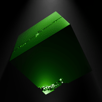
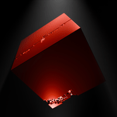

# Pixel Ingredients & Pack Staking

As part of season 1, we will introduce WaxDAO and the features there, from where we'll setup farms for certain of our templates to become stakeable for $PXJ, WUF and Wax.

These templates/schemas will initially be the Pixel Packs (that the Pixal PFPs blend into), and soon after their release to include the single pixels that the packs unpack into, as well as later the Pixel collectibles we'll end up crafting with them along the journey.

* Packs will initially generate at minimum 5 PXJ per hour
* Single Basic Pixels (Red - Blue - Yellow) will generate PXJ at \~0.5-1 PXJ per hour (making each pack unpacked generate 5-10 PXJ per hour by baseline, even after unpacking)&#x20;
* Upgraded Single Pixels (secondary/tertiary colors such as green - purple - orange - cyan) will stake for their components power + 50% per step of upgrade, while require some PXJ to be created in their blends

Pixel Upgrades will happen via blends on NeftyBlocks, and will be quite intuitive (e.g. red + blue pixels produce purple pixels .. each step upgrading single pixels rarity)&#x20;

<figure><figcaption>
Blue Pixel Ingredient
</figcaption></figure>

 

<figure><figcaption>
Pixel Ingredient Pack
</figcaption></figure>

 

<figure><figcaption>
Green Pixel Ingredient
</figcaption></figure>

Further details on these mechanics will be announced on our Discord, so make sure to stay updated there about NFT Farm updates/setups, Pixel Ingredient packs become unpackable and their blends are enabled.

<figure><figcaption></figcaption></figure>
