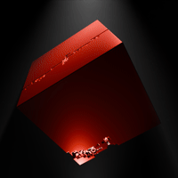

# Pixel Ingredients & Pack Staking

As part of season 1, we will introduce WaxDAO and the features there, from where we'll setup farms for certain of our templates to become stakeable for $PXJ, WUF and Wax.

These templates/schemas will initially be the Pixel Packs (that the Pixal PFPs blend into), and soon after their release to include the pixel ingredients that the packs unpack into, as well as later the Pixel collectibles we'll end up crafting with them along the journey.

* Packs will initially generate at minimum 5 PXJ per hour
* The base Primary Pixel Ingredients (Red - Blue - Yellow) generate PXJ at 0.45 PXJ per hour&#x20;
* Secondary Pixel Ingredients (green - purple - orange) generate 2.05 PXJ an hour, and require 25K PXJ + 2 primary ingredients to be created
* Tertiary Pixel Ingredients (amber, magenta, vermilion, chartreuse, teal and violet) stake for 12 PXJ an hour, and require 125K PXJ + a primary + secondary ingredient to be created

Pixel Ingredient Upgrades can happen via blends on NFTHive, WaxDAO and Neftyblocks, and will be quite intuitive (e.g. red + blue pixels produce purple pixels .. each step upgrading single pixels rarity)&#x20;


Ingredient Blends on NFTHive (no cooldowns, requires holding a Pixal PFP)



Ingredient Blends on Neftyblocks (24hr cooldown, requires holding a Pixal PFP)



Ingredient Blends on WaxDAO (no cooldowns, no ownership requirement .. scroll down till you find the Ingredients)


<figure><figcaption>
Blue Pixel Ingredient
</figcaption></figure> <figure><figcaption>
Pixel Ingredient Pack
</figcaption></figure> <figure><figcaption>
Yellow Pixel Ingredient
</figcaption></figure>

Further details on these mechanics will be announced on our Discord, so make sure to stay updated there about NFT Farm updates/setups, Pixel Ingredient packs become unpackable and their blends are enabled.

<figure><figcaption>
Red Pixel Ingredient
</figcaption></figure>

Stake your Pixel Ingredients on our WaxDAO Farm here:


[https://waxdao.io/v2/farm/pixeljourney](https://waxdao.io/v2/farm/pixeljourney)

