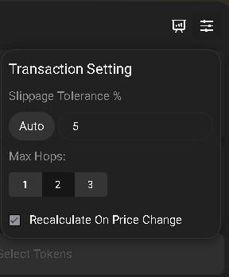

# Alcor Swaps

<figure><figcaption>
The Alcor Swap UI
</figcaption></figure>

### Swaps on Alcor

From the Alcor Start page, select "Swap" from the top menu to access the AMM swap interface.

Swaps on Alcor are simple to do with a few simple steps:

**1. Selecting Tokens to Sell/Buy in the swap conversion**

* **Choose Tokens**: Select the tokens you wish to swap. For instance, if you want to swap WAXP for PXJ, choose WAXP in the "Sell" field and PXJ in the "Buy" field.

**2. Setting the Amount**

* **Amount to Swap**: Enter the amount of the token you want to swap in either the "Sell or Buy" fields. The corresponding matching amounts will appear in the opposite field automatically updated based on the current exchange rate.

**3. Reviewing the Swap Details**

* **Price and Slippage**: Check the price impact and slippage tolerance. Adjust the slippage tolerance if necessary to avoid failed transactions.

<figure><figcaption>
1.6% price impact swap
</figcaption></figure>

 

<figure><figcaption>
49% price impact swap
</figcaption></figure>

**4. Sign the Transaction**

* **Approve and Swap**: Click "Approve" to allow Alcor to access your tokens. Once approved, click "Swap" to execute the transaction.
* **Transaction Confirmation**: Confirm the transaction in your wallet. Wait for the transaction to be processed and confirmed on the blockchain.

**5. Post swap checks**

* **Updated Balance**: After the swap is complete, your new token balance will be visible in your wallet.
* **Transaction Details**: To view your transaction history, check the "History" section in Alcor or use the [WAX Block Explorer](https://wax.eosauthority.com/) to search for your account and review past transactions.

### Transaction Settings

<figure><figcaption></figcaption></figure>

In the Transaction Settings you can control your Slippage Tolerance % for using the swap.\
This option allows you to allow your transactions to complete even though the price changes from the last data of the swap, to the time you get your TX signed/pushed to the chain.

Max Hops sets how many Alcor Pool pairs you wish to route your swaps through. Higher number of Hops uses more CPU per transaction, but may return better swap rates.


**Tips for Using Alcor AMM Swaps**

* **Liquidity/Slippage**: Ensure there is enough liquidity in the pools for the tokens you want to swap.
* **Market Conditions**: Be aware of market conditions as they can affect the swap rates, or slippage tolerance needed.
* **Security**: Always use a secure and trusted wallet, and double-check the token contract addresses.

